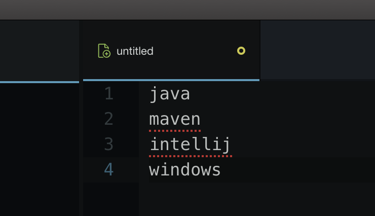
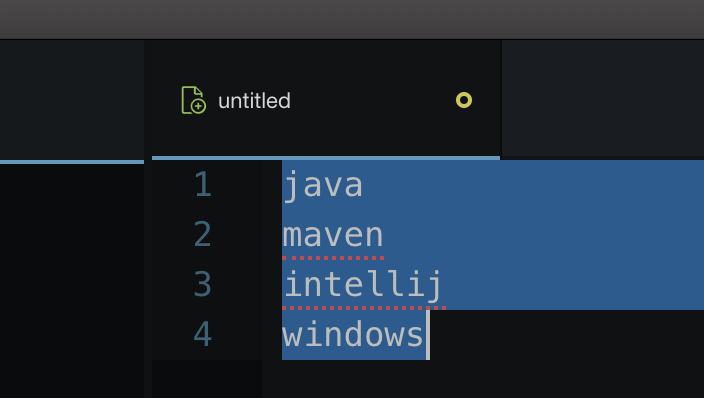
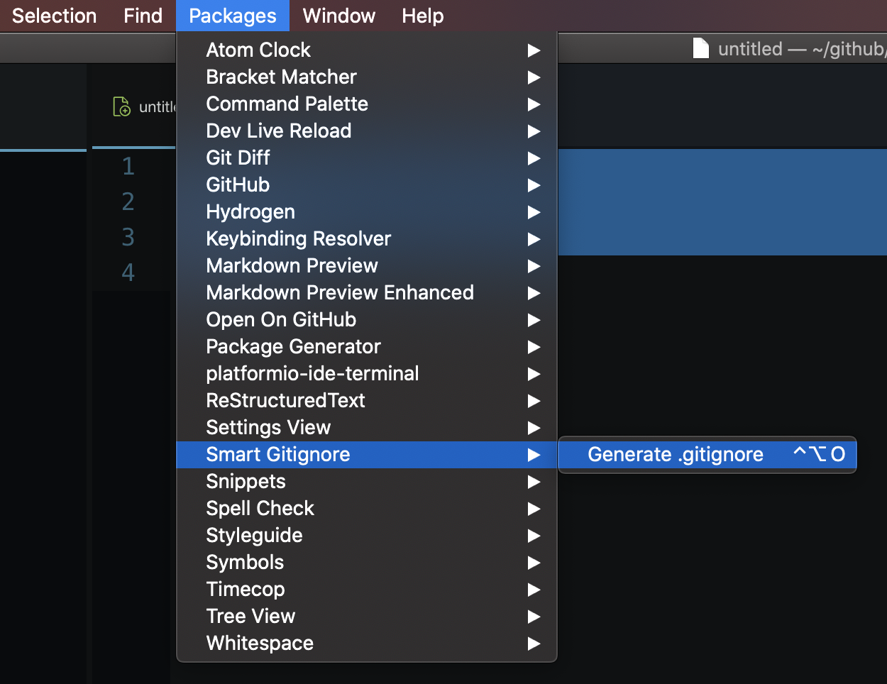
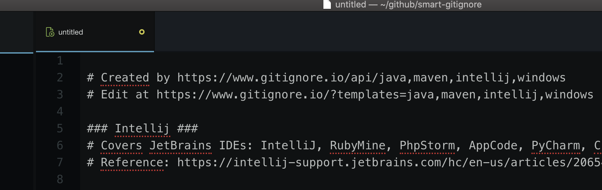

# smart-gitignore package

Generate a clean `.gitignore` file from Atom.

## Installation

Install the package through Atom or with `apm`:

```bash
apm install smart-gitignore
```

## Features

**Thanks to [Gitignore.io](https://www.gitignore.io/)**

The package generates a `.gitignore` file based on a list of templates. This works by calling the [https://www.gitignore.io/](https://www.gitignore.io/) api. Instead of navigating to the website, you can ask Atom to generate your `.gitignore` file.

The complete documentation for `gitignore.io` can be found at [https://docs.gitignore.io/](https://docs.gitignore.io/).

## Example

In a new file, list the templates you want to include in your `.gitignore`:



Select all the templates:



Hit the `Generate .gitignore` shortcut:



Finally the file content will be replaced with the `.gitignore` from gitignore.io:


